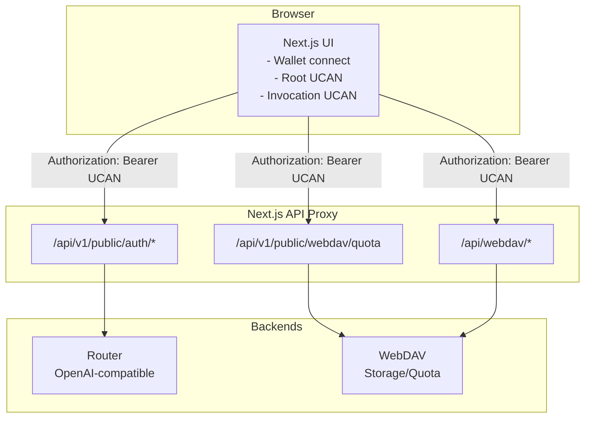

# Router and WebDAV Integration

This document explains how the current Chat integrates Router and WebDAV using UCAN, including request flow and key configuration points.

## Goals

- One wallet authorization (UCAN Root) enables access to multiple backends (Router + WebDAV).
- Router provides OpenAI-compatible APIs; WebDAV provides storage and quota services.
- Next.js acts as both UI and API proxy to unify CORS and auth.

## Request Flow

## Router Integration

- **Entry point**: `app/client/platforms/openai.ts` generates Invocation UCAN for Router requests.
- **Header**: `Authorization: Bearer <UCAN>`.
- **Proxy path**: `/api/v1/public/auth/*` with an allowlist for permitted backend routes.
- **Audience**: `NEXT_PUBLIC_ROUTER_UCAN_AUD` if set; otherwise derived as `did:web:<router-host>`.

## WebDAV Integration

- **Quota**: `app/plugins/webdav.ts` calls `/api/v1/public/webdav/quota` via `authUcanFetch`.
- **Sync**: `/api/webdav/*` handles WebDAV file sync with method and path restrictions to prevent SSRF.
- **Headers**: quota proxy uses an allowlist to avoid forwarding sensitive headers.
- **Audience**: `NEXT_PUBLIC_WEBDAV_UCAN_AUD` if set; otherwise derived as `did:web:<webdav-host>`.

## UCAN Session and Local Storage

- Root UCAN and session are stored in IndexedDB: `yeying-web3 / ucan-sessions`.
- Key cached fields in `localStorage`:
  - `currentAccount`
  - `ucanRootExp`
  - `ucanRootIss`
- Each backend request creates a fresh Invocation UCAN, enabling multi-backend access after a single authorization.

## Key Environment Variables

- `ROUTER_BACKEND_URL`: Router backend URL (required)
- `WEBDAV_BACKEND_URL`: WebDAV backend URL (required)
- `NEXT_PUBLIC_UCAN_RESOURCE`: default capability resource (e.g. `profile`)
- `NEXT_PUBLIC_UCAN_ACTION`: default capability action (e.g. `read`)
- `NEXT_PUBLIC_ROUTER_UCAN_AUD`: Router audience (optional)
- `NEXT_PUBLIC_WEBDAV_UCAN_AUD`: WebDAV audience (optional)

## Security Notes

- Router proxy enforces an allowlist of routes.
- WebDAV sync proxy restricts methods and target paths to prevent SSRF.
- Quota proxy uses header allowlist to avoid sensitive header forwarding.
- Ensure UCAN `aud` matches backend configuration.

